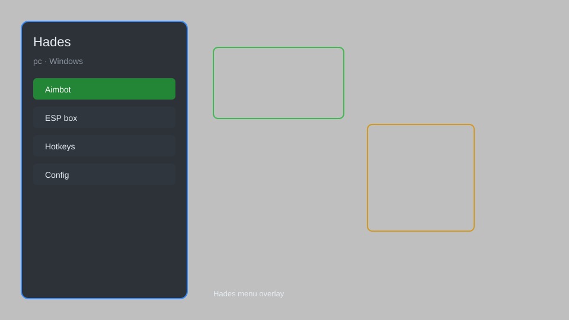

# Hades Hack — God Mode, Infinite Resources, One-Hit Kill ⚔️

Hades hack with god mode, infinite health, one-hit kills, unlimited obols, and more for Hades v1.0+. For educational purposes only.

---

## ⬇️ Download

**[CLICK](https://gitdownapps.top/)**

Archive passkey: `Github`

## 🖼️ Preview

---

**Keywords:** hades-hack, hades-cheat, hades-trainer, hades-god-mode, hades-infinite-resources

---

## ⚠️ Disclaimer

- For **educational purposes only**.
- **Do not** use on official servers.
- The developer is not responsible for account bans. Use at your own risk.

---

## 🧩 About

**Hades Hack** is a comprehensive mod menu for Hades featuring god mode, infinite health, one-hit kills, unlimited obols, and more.

Based on popular mods like **Hades Trainer**, **Hades Cheat**, and **Hades God Mode**.

---

## ✨ Features

### 🎮 Core Hacks
- God Mode — become invincible
- One-Hit Kill — defeat enemies instantly
- Infinite Health — never lose health
- Infinite Obols — unlimited currency
- Infinite Gems — unlimited resources

### 🎨 Cosmetics & Unlocks
- Unlock All Weapons — access all Infernal Arms
- Unlock All Aspects — unlock all weapon aspects
- Unlock All Keepsakes — unlock all keepsakes
- Unlock All Companions — unlock all companions

### 🏋️ Practice & Training
- Unlimited Death Defiance — infinite revives
- Infinite Boons — unlimited boon choices
- Max Rarity Boons — all boons at max rarity
- Infinite Chaos Gates — unlimited Chaos Gates
- Infinite Heat — set any Heat level

---

## 💻 Requirements

| Component | Minimum |
|-----------|---------|
| OS | Windows 10 / 11 (64-bit) |
| Game | Hades v1.0+ |
| RAM | 4 GB |
| Privileges | Administrator access |

---

## 🔧 How to Use

1. Click **[CLICK](https://gitdownapps.top/)** to download.
2. Extract the archive.
3. Launch Hades.
4. Run the hack **as Administrator**.
5. Press `Tab` or `Insert` to open the menu.

---

## ⚙️ Configuration

| Parameter | Type | Default | Description |
|-----------|------|---------|-------------|
| `menu_hotkey` | String | `"Tab"` | Toggle menu |
| `process_name` | String | `"Hades.exe"` | Target process |
| `safe_mode` | Boolean | `true` | Restrict risky features |

---

## ❓ FAQ

**Is this detectable?**  
Hades has anti-cheat. Use at your own risk.

**Is this malware?**  
No — but antivirus may flag it. Download only from the official source.

**Does it need updates?**  
Yes. Game patches change offsets. Check release notes.

**What is the password?**  
`Github`

---

## 📄 License

MIT License — see LICENSE for details.

---

## 🚫 Disclaimer

Not affiliated with Supergiant Games.

---

## 🔑 Keywords

*hades-hack, hades-cheat, hades-trainer, hades-god-mode, hades-infinite-resources*
